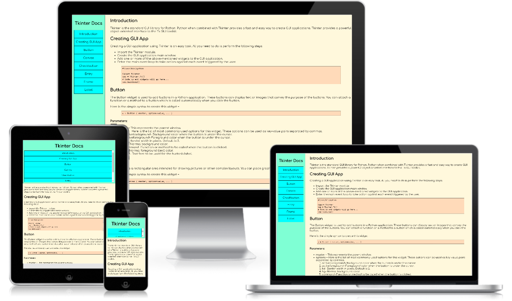
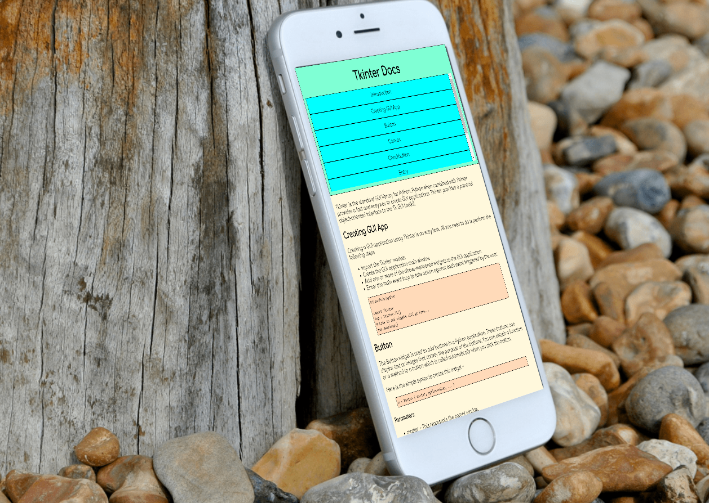
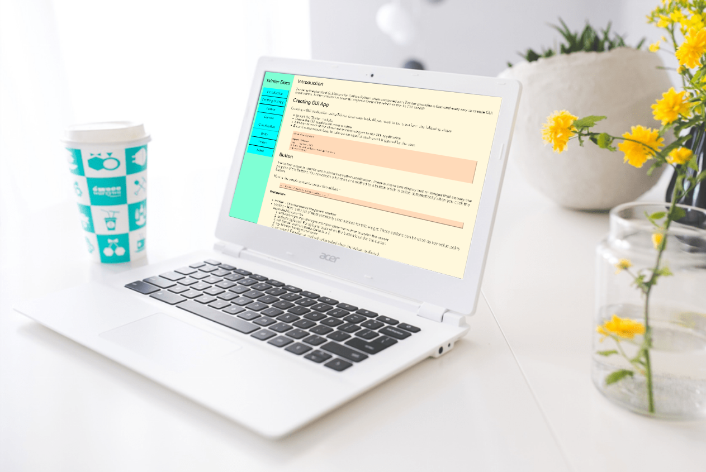

# A technical documentation page

I have made a technical documentation page which is totally responsive and made purely out of HTML and CSS.

## Fork it

You can find/fork this as well as my other projects on [CodePen](https://codepen.io/b30wulffz/) profile.

## ScreenShots

You can visit the website by clicking [here](https://b30wulffz.github.io/documentationPage/). It makes use of media queries and on resizing aligns itself, suitable for mobile, desktops, and tablets.

## Sources

This is one of the project for FCC: Responsive Web Design. I hope you like it.

I have used the Python Tkinter documentation from [TutorialsPoint](https://www.tutorialspoint.com/python/index.htm) as a demo for the content.

## Contributing

Pull requests are welcome. For major changes, please open an issue first to discuss what you would like to change.

The responsiveness for mobile might be buggy. Feel free to report and/or fix it.

Please make sure to update tests as appropriate.

## License
[GNU GPLv3](https://choosealicense.com/licenses/gpl-3.0/)
